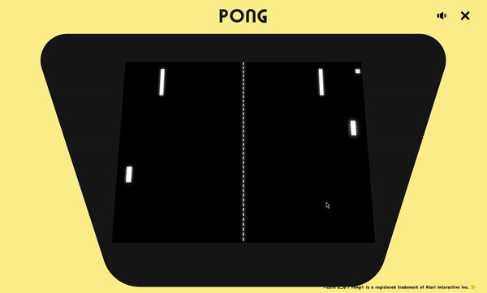

# Pong online (JS + React + Node.js + Express + Socket.io)

  

Yes, it's yet another pong clone but I tried to make it as complete as portfolio project can be.  
Check the **[working DEMO](https://pong1000000clone.herokuapp.com/)** (it's using Heroku free hosting so it's expected too act unexpectedly).

## Main Features

- It allows you to play the prototype version of fairly faithful Atari's pong port against another player via the Internet.
- UI is responsive so you can play with your desktop, tablet or smartphone.
- It's a Progressive Web App so it's recommended to add it to phone's main screen (viewport will be larger).
- After logging in to lobby you can browse all active games, create a new game or join existing one.

## Getting started

In order to run project properly you need Node.js environment installed (^10.15.1) and npm package manager (^6.4.1). Run `npm i` command in projects folder in order to install all dependencies and then `npm start` to run it locally.

## Available Scripts

In the project directory, you can run:

### `npm start`

Runs local server with nodemon. 
Open [http://localhost:3000](http://localhost:3000) to view it in the browser.

### `npm test`

Launches the test runner in the interactive watch mode. 

### `npm run build`

Builds the app for production to the `build` folder. 
It correctly bundles React in production mode and optimizes the build for the best performance.
The build is minified and the filenames include the hashes. 
Your app is ready to be deployed!

### `npm run eject`

If you aren’t satisfied with the build tool and configuration choices, you can `eject` at any time. This command will remove the single build dependency from your project. Instead, it will copy all the configuration files and the transitive dependencies (Webpack, Babel, ESLint, etc) right into your project so you have full control over them. All of the commands except `eject` will still work, but they will point to the copied scripts so you can tweak them. At this point you’re on your own.

## License

This project is licensed under the MIT License. App's design is made in homage for old Atari's arcade machines. Pong® is a registered trademark of Atari Interactive Inc.

## Possible Enhancements

- add difficulty levels and ways to customize games,
- improve game physics,
- add delays between rounds,
- make it React Native app,
- use hosting with better performance

This project was bootstrapped with [Create React App](https://github.com/facebook/create-react-app).
